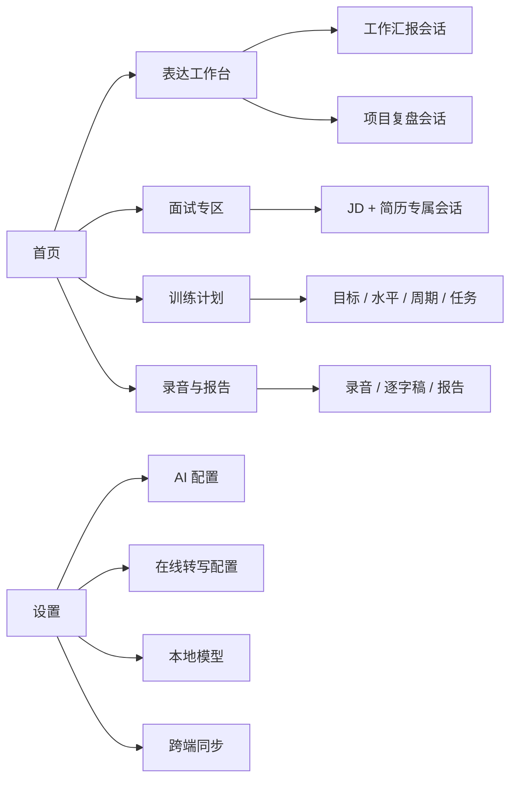
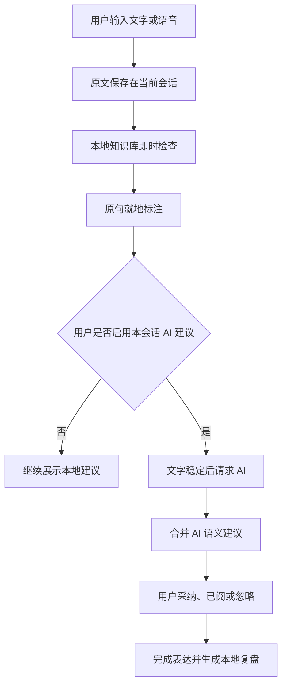
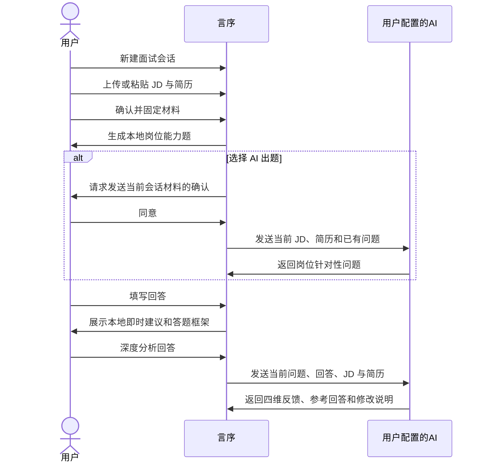
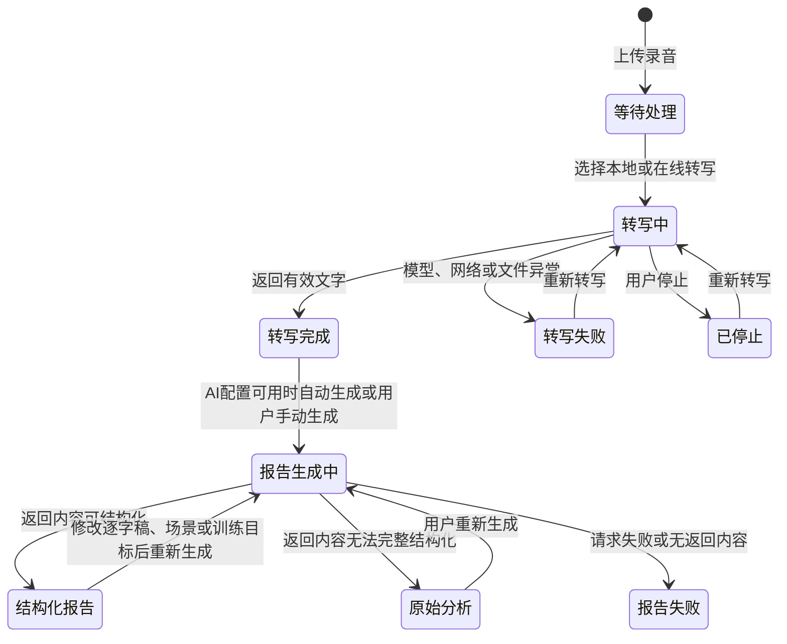
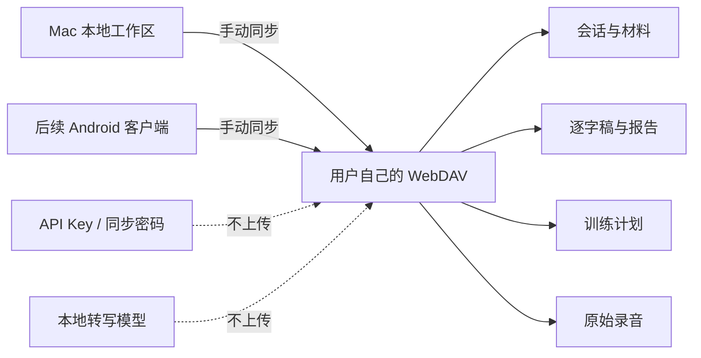

# 言序结构化表达训练工作台

## 1. 背景与目标

### 1.1 产品背景

面试、工作汇报和项目复盘都要求表达者在有限时间内说清楚结论、依据、个人贡献和下一步。用户通常知道自己“说得不够好”，却难以在表达当下定位具体问题，也缺少能够长期保存、反复练习和观察变化的工具。

言序是一款面向个人使用的本地优先表达训练应用。它从用户的原话出发，在不替用户重写整段内容的前提下标注局部问题，并通过面试模拟、录音复盘和训练计划帮助用户持续改善表达。

### 1.2 产品定位

产品第一身份为“表达训练工作台”，采用双速反馈模式：

- 本地知识库负责即时、稳定、低成本的表达标注。
- 用户自行配置的 AI 负责语义判断、岗位针对性反馈和结构化总结。
- 本地转写负责隐私优先的日常使用，在线转写作为高精度补充选项。

### 1.3 核心目标

1. 用户输入或说话时，可以立即看见原句中的具体问题，而不是等待整段重写。
2. 用户可以围绕固定的 JD 和简历完成真实的面试准备与模拟。
3. 用户上传录音后，可以获得逐字稿、校对入口和可阅读的分析报告。
4. 用户可以建立训练计划，并把真实练习、报告和进步记录关联起来。
5. 用户的数据默认保存在本地，同时支持个人设备之间同步完整历史。

### 1.4 当前交付范围

| 范围 | 当前状态 | 说明 |
|---|---|---|
| Mac 桌面应用 | 已实现 | 可安装运行，支持 Apple Silicon 与 Intel Mac |
| Web 响应式界面 | 已实现 | 用于页面预览与业务逻辑复用 |
| Android 应用 | 后续规划 | 复用领域逻辑，采用移动端单栏交互和独立端侧转写方案 |
| 多用户账号体系 | 不在当前范围 | 当前面向单用户使用 |
| 平台托管 AI 额度 | 不在当前范围 | 用户填写自己的兼容接口配置 |

## 2. 用户与场景

### 2.1 目标用户

- 正在准备求职面试，希望围绕具体岗位反复练习的人。
- 需要定期做周报、项目汇报或方案汇报的职场用户。
- 需要从真实会议、面试或汇报录音中复盘表达的人。
- 重视隐私，希望录音和历史内容优先保存在个人设备上的用户。

### 2.2 核心场景

| 场景 | 用户任务 | 产品结果 |
|---|---|---|
| 工作汇报 | 把进展、结果、风险和下一步说清楚 | 局部标注问题，形成可复用的汇报表达 |
| 项目复盘 | 区分目标、事实、原因和行动 | 识别证据缺口、归因问题和行动闭环 |
| 面试准备 | 围绕 JD 和简历准备问题与答案 | 获得岗位针对性问题、追问、反馈和参考回答 |
| 录音复盘 | 上传会议、面试或汇报录音 | 获得逐字稿、时间戳、校对入口和分析报告 |
| 长期训练 | 把零散练习组织成连续计划 | 跟踪任务、关联练习并回看阶段变化 |

## 3. 产品信息架构

一级导航顺序固定为：首页、表达工作台、面试专区、训练计划、录音与报告、设置。



### 3.1 首页职责

首页只承担导航和进度概览，不重复承载完整训练功能：

- 展示当前进行中的训练计划及完成进度。
- 提供工作汇报、项目复盘和面试专区的明确入口。
- 展示最近一条表达会话，支持继续练习。
- 提供上传录音的快捷入口。

### 3.2 会话隔离原则

- 表达会话、面试会话和录音复盘会话彼此独立。
- 每个会话独立保存输入、建议、回答、材料、报告和更新时间。
- 搜索、归档、恢复和删除只作用于当前类型的会话。
- AI 请求只携带当前会话需要的内容，不发送其他会话数据。

## 4. 核心产品逻辑

### 4.1 双速表达训练

本地规则始终提供快速反馈；AI 作为可选增强能力，在用户明确启用后补充更深的语义建议。



### 4.2 面试模拟

一个面试会话只对应一份 JD 和一份简历。材料确认后固定，避免不同岗位和经历互相污染；更换材料时新建会话。



### 4.3 录音转写与报告



报告遵循“内容优先交付”原则：只要 AI 返回非空内容，系统就必须保存并展示。标准结构解析成功时展示评分、维度、亮点、建议和练习目标；结构不完整时尽量提取已有字段；完全无法解析时使用全宽的“AI 原始分析”视图展示完整内容。格式或引用问题不能导致整份报告不可见。

### 4.4 数据保存与跨端同步



## 5. 功能清单

| 模块 | 功能 | 当前状态 |
|---|---|---|
| 首页 | 场景入口、最近会话、训练进度、录音入口 | 已实现 |
| 表达工作台 | 文字输入、语音输入、即时标注、局部采纳、AI 语义建议、历史会话 | 已实现 |
| 面试专区 | JD/简历导入、材料固定、本地/AI 出题、追问、答案分析、参考回答 | 已实现 |
| 训练计划 | 目标、水平、周期、任务、计划状态、练习关联、阶段回看 | 已实现 |
| 录音与报告 | 音频上传、本地/在线转写、时间戳校对、场景报告、历史录音 | 已实现 |
| 本地转写 | Mac 原生高精度模型、模型下载、暂停、删除、进度和停止 | 已实现 |
| AI 配置 | OpenAI-compatible 服务、DeepSeek 快捷配置、连接测试、本机凭证 | 已实现 |
| 知识库 | 通用、汇报、复盘、面试规则与词语模式 | 已实现，可继续扩充 |
| 数据管理 | 本地保存、归档、删除、清理全部本地数据 | 已实现 |
| 跨端同步 | WebDAV 同步会话、材料、报告、计划与录音 | 已实现 |
| Android 客户端 | 移动端单栏交互、本地模型适配 | 后续规划 |

## 6. 功能需求

### 6.1 首页

首页帮助用户快速开始一次真实任务，而不是要求用户先理解产品结构。

- 当前计划
  - 有进行中计划时，展示已完成任务数、总任务数和继续训练入口。
  - 没有进行中计划时，引导用户创建训练计划。
- 场景入口
  - 工作汇报和项目复盘直接创建对应表达会话。
  - 面试入口进入独立的面试专区，不与普通表达会话混用。
- 历史继续
  - 展示最近更新且未归档的表达会话。
  - 用户点击后进入该会话继续输入。
- 快速录音
  - 进入录音与报告页面，开始上传真实录音。

### 6.2 表达工作台

#### 6.2.1 会话管理

- 用户可以新建、搜索、切换、重命名、归档、恢复和删除会话。
- 历史会话保留各自原文、已忽略建议、完成记录和复盘结果。
- 汇报与复盘共用工作台，但使用不同检查标准；切换模式时同步变更会话场景。

#### 6.2.2 文字输入与即时标注

- 左侧输入区始终保存用户原文，右侧同步展示原句。
- 本地知识库随文字变化即时运行，不需要用户点击确认。
- 建议分为局部标注和整段建议：
  - 局部标注定位到具体词句。
  - 整段建议用于结论、证据、行动闭环等结构问题。
- 有可靠替换词时，以“划掉旧词 + 高亮新词”展示；没有确定替换词时只给建议，不凭空补词。
- 每条建议标记为“尚未采纳”，用户可采纳安全替换、标记已阅或忽略。

#### 6.2.3 语音输入

- 用户在当前表达会话中启动或停止语音输入。
- 开始前必须存在已安装的本地转写模型。
- 语音按短窗口持续识别，识别结果追加到当前会话原文，输入过程中继续提供本地标注。
- 用户离开会话或停止录音时，系统处理剩余音频并释放麦克风。

#### 6.2.4 AI 语义建议

- AI 语义建议按会话单独开启，默认不因进入页面而发送内容。
- 开启后，仅发送当前会话原文、当前场景和本地已发现的问题。
- 文字稳定后自动请求，两次请求保持最小间隔，避免逐字调用产生延迟和费用。
- 相同原文优先复用已保存建议；请求失败时本地标注继续可用。
- AI 建议不直接修改原文，也不生成无法确认的替换词。

#### 6.2.5 完成表达

- 用户完成表达后，系统保存本次文本及基础统计。
- 本地规则生成结构、清晰度、证据、简洁度和自信度参考结果。
- 用户可把复盘建议加入当前场景的训练计划。

### 6.3 面试专区

#### 6.3.1 面试会话与材料

- 每个会话固定一份 JD 和一份简历，内容和反馈不得跨会话读取。
- 用户可以粘贴正文，或上传 PDF、DOCX、TXT、Markdown、JSON、CSV 文件。
- 单个材料文件上限为 30 MB；扫描版 PDF 无可复制文字时提示先进行 OCR。
- JD 和简历均有正文后才可确认；确认后材料只读。
- 更换 JD 或简历时新建面试会话，保留原会话全部问题和回答。

#### 6.3.2 面试问题

| 模式 | 输入 | 输出 | 隐私行为 |
|---|---|---|---|
| 本地出题 | 当前 JD、简历和已有问题 | 最多六道岗位能力题，含岗位依据和可用的简历依据 | 数据不离开设备 |
| AI 出题 | 当前 JD、简历和已有问题 | 更深入的岗位针对性问题 | 首次发送前明确确认 |
| 本地追问 | 当前问题和回答 | 最多两道围绕贡献、依据、取舍或复盘的追问 | 数据不离开设备 |
| AI 追问 | 当前问题、回答、JD 和简历 | 围绕回答细节的追问 | 沿用当前停留期间的发送确认 |

- 本地问题不得使用职位编号、办公地点、薪资等招聘元信息作为面试题。
- 生成新问题时不重复已有问题。
- 旧版本本地题可更新；已有回答或反馈的问题继续保留。

#### 6.3.3 回答与反馈

- 每道题独立保存回答，切换问题后原回答不丢失。
- 作答期间展示本地表达建议和通用答题框架。
- AI 深度分析覆盖表达结构、JD 匹配、简历一致性和证据强度。
- AI 输出同时提供：
  - 优先优化建议。
  - 推荐答题结构。
  - 基于真实材料的参考回答。
  - 修改原因和仍需补充的事实。
  - 可追溯的简历或原回答依据。
- 参考回答标记为“尚未采纳”，不会覆盖用户原答案；未知事实使用待补充标记。

### 6.4 训练计划

#### 6.4.1 创建与编辑

训练计划由目标、当前水平、计划周期、训练任务和计划状态组成，所有字段均可由用户调整。

| 配置项 | 平台选项 | 用户自定义 |
|---|---|---|
| 训练目标 | 结论先行、减少口头禅、增强数据证据、提升 STAR 完整度、表达更简洁、增强自信感 | 支持输入任意目标并添加 |
| 当前水平 | 入门、进阶、强化 | 支持填写自评补充；也可使用最近同场景报告评估 |
| 计划周期 | 7 天、14 天、30 天 | 支持自行选择开始与结束日期 |
| 训练任务 | 三分钟结论先行、STAR 经历复述、模糊词替换 | 支持添加、编辑、删除、排序和设置时长 |
| 计划状态 | 草稿、进行中、暂停、完成、归档 | 用户主动切换 |

- 同一场景同一时间只允许一个进行中的计划。
- 已完成或已归档计划不可继续编辑，可复制为新计划。
- 单项任务时长必须在 1 至 1440 分钟之间。

#### 6.4.2 执行与回看

- 用户从计划任务进入对应的表达或面试会话。
- 首次开始时创建并关联会话，后续可继续进入同一会话。
- 用户可标记任务完成或恢复为待完成。
- 计划页展示任务完成进度和关联练习报告。
- 只有具备有效结构化评分的报告进入平均分与基线评估；AI 原始分析不参与分数计算。

### 6.5 录音与报告

#### 6.5.1 上传与历史录音

- 支持 WAV、MP3、M4A、AAC、FLAC、OGG、WebM 等常见音频格式。
- 上传前选择转写方式和分析场景；选择结果写入该录音任务。
- 每次上传创建独立录音会话，保留原始音频、逐字稿、报告和处理状态。
- 历史列表支持搜索、切换、重新转写和删除。
- 删除录音时同时删除对应会话、逐字稿和本机音频，并要求用户确认。

#### 6.5.2 本地转写

- Mac 客户端使用原生本地推理，优先利用设备图形计算能力。
- 提供高精度版和平衡版模型，模型由用户按需下载，不随安装包预置。
- 下载支持进度、暂停、继续、完整性校验和删除。
- 转写过程展示已用时间、音频处理进度和当前状态；用户可以停止并稍后重试。
- 转写结果包含完整逐字稿；模型提供时间戳时，同时生成可点击的分段列表。
- 原始音频和已校对逐字稿不会因转写失败、超时或停止而删除。

#### 6.5.3 在线高精度转写

- 用户主动选择在线转写后，才将当前音频发送到所配置服务。
- 在线转写配置与文本 AI 配置相互独立。
- 服务返回时间戳时，展示分段回听；未返回时仍保留完整逐字稿和播放器。
- 请求失败时保留原始录音，允许用户重试或切换转写方式。

#### 6.5.4 逐字稿校对

- 转写完成后，逐字稿可直接编辑。
- 点击时间戳分段时，播放器跳转到对应位置。
- 用户可为每个分段填写说话人标签。
- 修改逐字稿后，已有报告标记为需要更新，不自动覆盖用户编辑。

#### 6.5.5 报告生成与展示

- AI 配置可用时，转写完成后自动生成报告；用户也可手动生成或重新生成。
- 报告分析场景包括通用表达、面试回答、工作汇报和项目复盘，各场景使用不同分析标准。
- 生成请求使用逐字稿、当前分析场景，以及与当前会话关联的训练目标和重点。
- 内容交付规则：
  - AI 返回非空内容后必须保存并展示，不因格式、字段数量或引用匹配失败而隐藏。
  - 返回内容符合标准结构时，展示总分、五项维度、亮点、修改建议和下一次练习。
  - 返回内容为可识别的非标准 JSON 时，尽量提取标题、分数、维度、亮点、建议和行动项。
  - 返回内容无法解析时，以全宽“AI 原始分析”展示，保留换行并对 JSON 尝试自动缩进。
  - 原始分析不参与训练计划的平均分和水平评估。
- 仅当 AI 请求本身失败或没有返回内容时，报告状态显示失败，并保留旧报告与逐字稿。

### 6.6 知识库与反馈策略

#### 6.6.1 知识来源

知识库由两类内容组成：

1. 用户提供并整理的表达词典与规则素材。
2. AI 生成并经过样例检查的通用、汇报、复盘和面试规则。

当前版本包含 57 条可执行词语规则、227 个短语模式，以及结构和语义建议目录；知识库支持后续继续增加规则包。

#### 6.6.2 本地规则职责

- 识别口头禅、冗余、模糊措辞、重复连接词和句子负荷。
- 检查结论、证据、行动主体、负责人、时间、验证方式等结构要素。
- 汇报场景重点检查结果、风险、决策诉求和下一步。
- 复盘场景重点检查原始目标、事实与推测、根因证据、改进责任和验证标准。
- 面试场景重点检查个人贡献、岗位关联、决策依据和结果证据。

#### 6.6.3 AI 与本地规则协作

- 本地规则提供即时性、确定性和低成本反馈。
- AI 处理依赖上下文的语义问题，不替代本地即时反馈。
- AI 不可用时，表达工作台、面试本地题和本地转写仍可使用。
- AI 输出视为建议而非事实；涉及简历、数字和结果时提示用户自行核对。

### 6.7 设置与外部能力

#### 6.7.1 AI 配置

- 用户填写配置名称、模型名称、服务地址和 API Key。
- 支持 OpenAI-compatible 服务，并提供 DeepSeek 地址快捷设置。
- 用户可测试连接、启用配置并保存。
- API Key 仅保存在当前设备，不参与跨端同步。
- 同一套 AI 配置用于表达语义建议、面试出题与反馈、录音报告。

#### 6.7.2 本地模型管理

- 模型文件保存在当前设备，不参与同步。
- 展示模型名称、用途、预计体积和安装状态。
- 状态包括未安装、下载中、暂停、校验中、可用和失败。
- 应用升级后发现旧模型格式不兼容时，提示续装当前原生模型，不删除历史数据。

#### 6.7.3 数据与外观

- 自动保存默认开启；保存中、未保存和保存异常状态持续可见。
- 自动保存关闭或保存失败时，提供手动保存入口。
- 支持跟随系统、浅色和深色外观。
- 清理本地数据会删除当前设备上的会话、录音、报告和计划，不删除远端副本或本地模型。

### 6.8 跨端同步

#### 6.8.1 同步范围

同步包含：

- 表达与面试历史会话。
- JD、简历和其他会话材料。
- 题目、回答、反馈和报告。
- 训练计划及任务状态。
- 录音任务、逐字稿、时间戳和原始音频。

不同步：

- AI API Key。
- 在线转写 API Key。
- 同步密码。
- 本地转写模型文件和安装状态。

#### 6.8.2 同步行为

- 用户填写自己的 WebDAV 地址、账号、设备名称和密码。
- 支持连接测试和手动立即同步。
- 同步时先合并远端与本地数据，再上传当前完整工作区和原始录音。
- 同一条数据在两端均发生变化时，保留远端内容为带设备名的冲突副本，不静默覆盖。
- 删除操作通过删除记录同步，避免旧数据在另一台设备重新出现。
- 远端不支持并发保护时，不覆盖远端工作区，并提示用户再次同步。

## 7. 页面示意图

### 7.1 表达工作台

```text
┌──────────────┬─────────────────────────────┬──────────────────────────────┐
│ 历史会话      │ 原文输入                    │ 即时标注                     │
│ 搜索          │ [汇报] [复盘]       [语音] │ 本会话 AI 语义建议 [开关]   │
│ 今天 10:30    │                             │                              │
│ 项目周报      │ 用户输入或语音转写内容……   │ 原句：我们大概做了一些优化   │
│ 昨天 18:20    │                             │ 建议：补充具体范围和结果     │
│ 月度复盘      │                             │ 状态：尚未采纳               │
│               │              [完成表达]     │ [已阅建议] [忽略]            │
└──────────────┴─────────────────────────────┴──────────────────────────────┘
```

### 7.2 面试专区

```text
┌──────────────┬────────────────────────────────────────────────────────────┐
│ 面试记录      │ JD：已读取     简历：已读取       [用新材料新建]          │
│ 产品经理面试  ├────────────────────────────────────────────────────────────┤
│ 增长岗位      │ [本地出题] [AI 出题]                                   │
│               │ 问题 2/6：请讲一次你用数据定位业务问题的经历             │
│               │ 依据 JD：负责核心指标分析与实验                         │
│               │                                                          │
│               │ [回答输入区]                                             │
│               │ [根据回答追问] [深度分析回答] [下一题]                   │
│               ├───────────────────────────┬────────────────────────────────┤
│               │ 这道题怎么回答            │ AI 优化参考 · 尚未采纳        │
│               │ 1. 直接回答                │ 原回答 / 优化回答对照          │
│               │ 2. 情境与目标              │ 修改原因 / 待补充事实          │
│               │ 3. 行动与结果              │                                │
└──────────────┴───────────────────────────┴────────────────────────────────┘
```

### 7.3 录音与报告

```text
┌──────────────┬────────────────────────────────────────────────────────────┐
│ 历史录音      │ 录音标题                         [删除]                    │
│ 搜索          │ 本地转写 · 工作汇报 · 14:37                                │
│ 录音 A 已完成 │ [音频播放器]                                               │
│ 录音 B 失败   │                                                            │
│               │ 逐字稿（可直接校对）                                      │
│               │ [完整逐字稿输入区]                                        │
│               │                              [生成 / 重新生成报告]         │
│               ├────────────────────────────────────────────────────────────┤
│               │ 标准结构：评分 + 五维依据 + 亮点 + 建议 + 练习目标         │
│               │ 降级结构：全宽 AI 原始分析，保留换行并自动格式化 JSON       │
└──────────────┴────────────────────────────────────────────────────────────┘
```

### 7.4 训练计划

```text
训练目标 → 当前水平与场景 → 计划周期 → 训练任务 → 计划状态
   │              │              │             │            │
推荐+自定义    自评/报告基线    快捷+自定义    推荐+自定义   草稿至归档
                                                  │
                                                  ▼
                                      启动任务并关联真实练习会话
                                                  │
                                                  ▼
                                      回看完成进度与可评分报告
```

## 8. 状态与异常处理

### 8.1 通用保存

| 状态 | 用户看到什么 | 可执行操作 |
|---|---|---|
| 已保存 | “已保存到本地” | 正常继续使用 |
| 正在保存 | 持续状态提示 | 继续编辑，系统完成保存 |
| 有未保存更改 | 未保存提醒 | 自动保存或手动保存 |
| 保存异常 | 错误原因和“重试保存” | 重试；应用退出前再次保存 |

### 8.2 转写异常

| 异常 | 处理 |
|---|---|
| 未安装本地模型 | 引导前往设置下载，保留录音任务 |
| 模型下载中断 | 标记暂停，允许继续下载 |
| 转写失败 | 保留原始音频与已有逐字稿，提供重新转写 |
| 长时间无进度 | 提示可能仍在推理，允许继续等待或停止 |
| 应用重启时任务未完成 | 转为可重试失败状态，不自动删除数据 |
| 在线服务失败 | 展示服务错误，允许重试或切换本地转写 |

### 8.3 AI 异常

| 情况 | 处理 |
|---|---|
| 未配置 AI | 本地能力继续可用，引导前往设置 |
| 请求失败 | 展示明确错误，保留原文、回答和旧报告 |
| AI 返回标准报告 | 使用结构化报告视图 |
| AI 返回非标准 JSON | 提取可识别字段后展示 |
| AI 返回普通文本 | 使用全宽原始分析视图展示完整内容 |
| AI 返回内容含不可靠引用 | 不阻断展示；仅视为未经验证的 AI 内容 |

### 8.4 并发与内容保护

- 同一时间只运行一个本地模型任务，避免多个转写任务争抢设备资源。
- 用户在 AI 分析期间修改原文、场景或训练目标时，旧结果不覆盖新内容。
- 用户删除会话或录音后，迟到的异步结果不能恢复已删除数据。
- 用户在转写期间编辑逐字稿时，保留人工修改，不使用识别结果覆盖。

## 9. 数据与隐私

| 数据 | 默认位置 | 是否同步 | 是否发送到 AI/在线服务 |
|---|---|---|---|
| 会话、回答、逐字稿、报告、计划 | 本地工作区 | 用户启用 WebDAV 后同步 | 仅按具体功能发送当前会话必要内容 |
| 原始录音 | 当前设备 | 用户启用 WebDAV 后同步 | 仅选择在线转写时发送 |
| JD 与简历 | 当前面试会话 | 用户启用 WebDAV 后同步 | AI 出题或分析前明确确认 |
| AI API Key | 当前设备安全存储 | 不同步 | 仅用于调用用户配置的服务 |
| 同步密码 | 当前设备安全存储 | 不同步 | 仅用于连接用户配置的 WebDAV |
| 本地模型 | 当前设备 | 不同步 | 不发送 |

## 10. 客户端与兼容要求

### 10.1 Mac

- 支持 Apple Silicon 与 Intel Mac 的通用安装包。
- 最低支持 macOS 10.15。
- 本地长音频转写使用设备原生加速能力。
- 应用关闭前完成本地数据保存；保存失败时阻止直接退出并提示重试。

### 10.2 Web

- 复用完整业务页面和响应式布局。
- 浏览器无法使用 Mac 原生转写时，使用浏览器本地转写能力作为独立运行路径。
- 浏览器环境的 API Key 只保留在当前页面生命周期，不承诺持久安全存储。

### 10.3 Android 后续规划

- 复用会话、知识库、报告、训练计划和同步的数据结构。
- 页面采用移动端单栏流程，不直接压缩桌面三栏布局。
- 本地转写使用适合 Android 的端侧模型运行方案，并保留在线高精度选项。
- 与 Mac 通过同一用户配置的同步服务交换全部业务数据和原始录音。

## 11. 验收标准

### 11.1 表达工作台

| 场景 | 预期 |
|---|---|
| 用户连续输入文字 | 原文同步展示，本地建议随输入更新，无需确认 |
| 建议有可靠替换词 | 同时看见旧词、新词和修改原因，默认尚未采纳 |
| 建议没有可靠替换词 | 只显示问题与建议，不生成替换内容 |
| 开启 AI 语义建议 | 仅当前会话原文被发送，结果与本地建议共同展示 |
| 切换历史会话 | 输入、建议和完成状态互不干扰 |

### 11.2 面试专区

| 场景 | 预期 |
|---|---|
| JD 或简历缺失 | 不允许固定材料或开始岗位针对性模拟 |
| 固定材料后点击生成 | 获得与岗位能力相关的问题，不出现职位编号或地点类无效问题 |
| 填写回答后点击追问 | 新问题针对当前回答细节，原回答保留 |
| 深度分析回答 | 展示四维反馈、答题框架、优化参考回答和修改原因 |
| 新建另一面试会话 | 新会话使用独立 JD 和简历，不读取上一会话材料 |

### 11.3 录音与报告

| 场景 | 预期 |
|---|---|
| Mac 选择本地模型转写 | 使用原生本地推理，展示真实进度和已用时间 |
| 转写失败或用户停止 | 原始录音保留，可重新转写 |
| 转写完成 | 展示可编辑逐字稿；有时间戳时可定位回听 |
| AI 返回标准 JSON | 展示结构化报告 |
| AI 返回字段不完整的 JSON | 提取已有字段并以可读报告形式展示 |
| AI 返回普通文本或不可解析内容 | 使用全宽原始分析视图展示完整内容 |
| AI 返回内容存在引用风险 | 仍然展示，不将内容作为已核验事实或训练分数依据 |

### 11.4 训练计划与同步

| 场景 | 预期 |
|---|---|
| 创建计划 | 推荐项和自定义项均可使用，字段校验明确 |
| 启动计划任务 | 创建或打开关联练习会话 |
| 报告为原始 AI 内容 | 可回看，但不进入平均分和基线水平计算 |
| 两台设备修改同一数据后同步 | 保留冲突副本，不静默覆盖任一版本 |
| 同步包含录音 | 另一设备可恢复原始录音及对应逐字稿和报告 |

## 12. 版本路线

### 12.1 当前版本

- Mac 本地应用。
- Web 响应式界面。
- 本地表达规则与知识库。
- Mac 原生离线转写与在线转写选项。
- 用户自有 AI 配置。
- WebDAV 全量数据与录音同步。

### 12.2 后续版本

- Android 本地应用及端侧转写。
- 知识库持续扩充、版本管理和用户自定义规则导入。
- 更完整的长期进步趋势和训练建议调整。
- 在不损失原始内容的前提下，提高非标准 AI 返回的结构化恢复能力。

